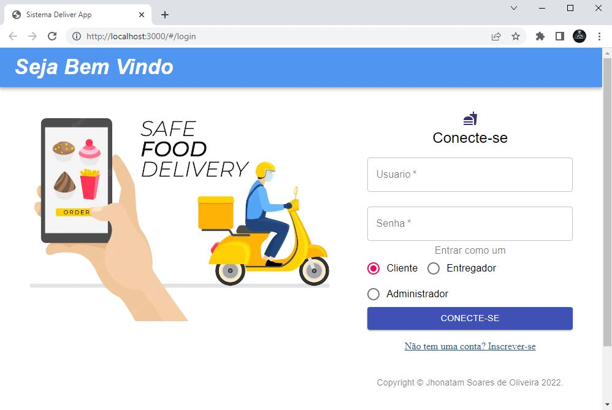
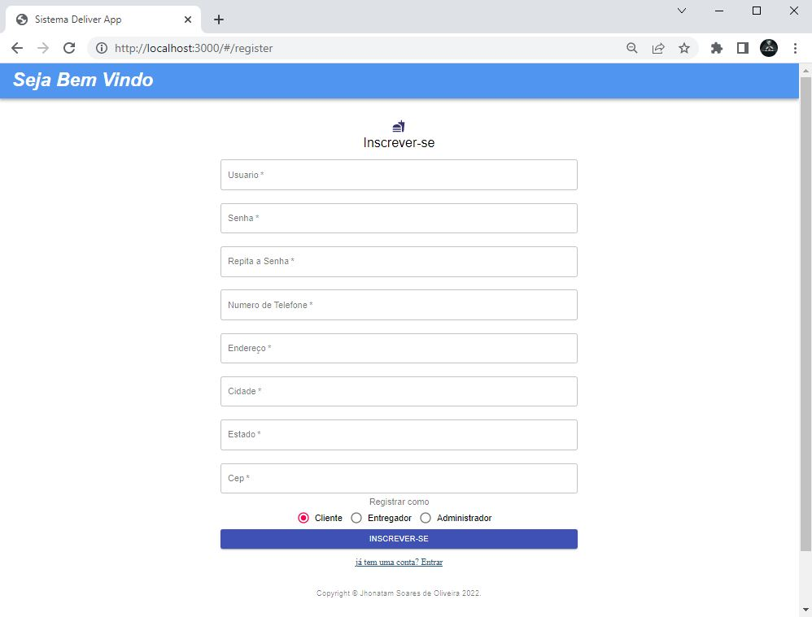

# Sistema-Delivery
Este é um aplicativo de entrega de comida usando Springboot + React + MongoDB. O aplicativo é implantado no Heroku: https://delivery-sist.herokuapp.com/#/login

O aplicativo permite que os usuários simulem entre cliente, motorista e restaurante em um sistema de entrega de comida.

Página de login

Pádina de registro

Pesquisa do cliente por restaurante ou comida

Pedido do Cliente

Motorista Aceitar/Finalizar o Pedido

Informações de edição do restaurante

Restaurante Adicionar ou Excluir Menu

Cliente Adicionar ou Excluir Comentário e Avaliação

