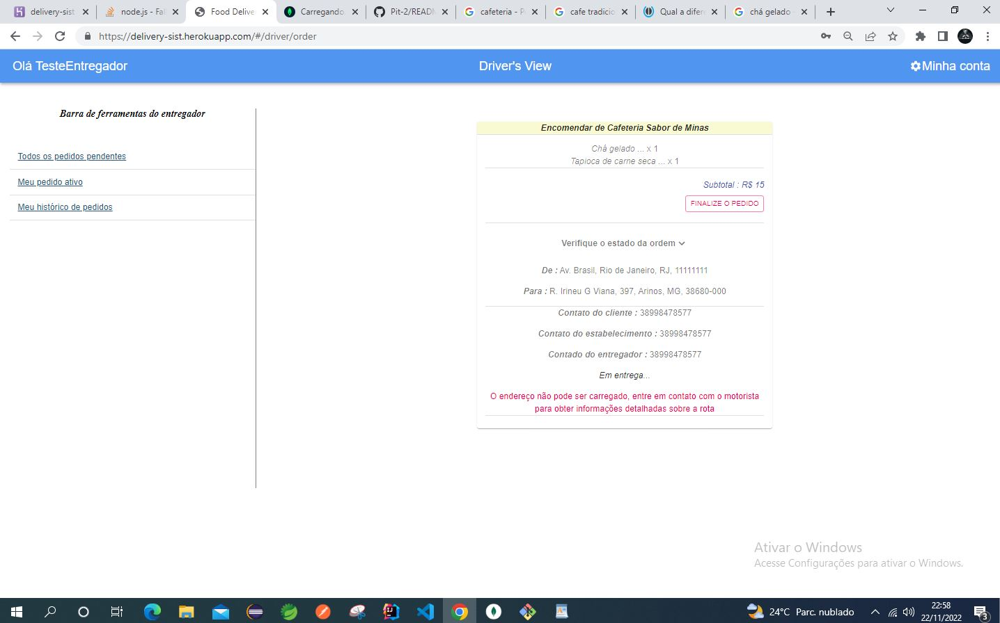

# Sistema-Delivery
Este é um aplicativo de delivery usando Springboot + React + MongoDB. O aplicativo é implantado no Heroku: https://delivery-sist.herokuapp.com/#/login

O aplicativo permite que os usuários simulem entre cliente, entregador e estabelecimento em um sistema de delivery.

Página de login

Pádina de registro

Pesquisa do cliente por restaurante ou comida

Pedido do Cliente

Entregador Aceitar/Finalizar o Pedido

Edição de informações do estabelecimento

Adicionar ou excluir Produtos

Cliente Adicionar ou Excluir Comentário e Avaliação

